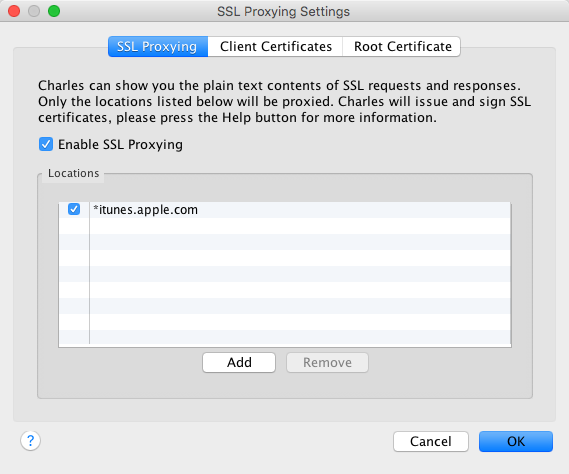
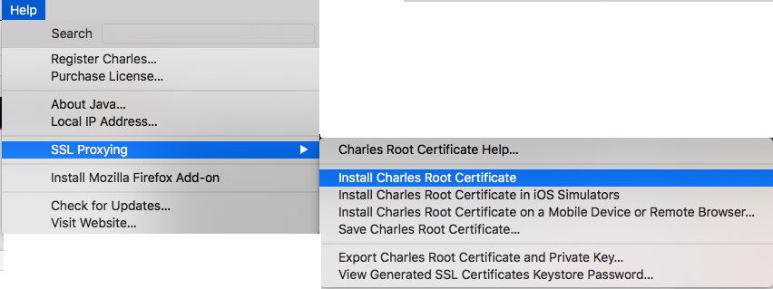

# 网易云音乐 导入 Apple Music

## 使用方法

### 使用代理截取 Apple Music 的 Cookie

* 在电脑上打开 [Charles](http://www.charlesproxy.com)(或类似应用)
* 确保 SSL 代理启用并且正常工作
    - 菜单->Proxy->SSL Proxying Settings...
      
    - 安装 Charles 根证书并信任
      
* 在 Apple Music 中随便选取一首歌增加到你的音乐库中
* 在 Charles 中找到 `https://ld-5.itunes.apple.com/WebObjects/MZDaap.woa/daap/databases/1/cloud-add` 的请求，拷贝 `X-Dsid`,  `Cookie`,  `X-Guid` 和 `User-Agent` 这四个请求标头

### 开始导入

更改`add_songs`中的相应`headers`

```
python playlist2csv.py [User-Agent] [X-Dsid] [Cookie] [X-Guid] [playlist_id]
```

> 假设播放列表的链接为 `http://music.163.com/#/m/playlist?id=12345678` 则 `playlist_id` 为 `12345678`

## 已知问题

### Missing songs
The script I'm using to retrieve the Apple Music identifier for a Spotify song is quite basic. It simply compares the title and artist to find out if a Spotify and Apple Music song match. Some songs don't have the exact same title (extraneous spacing for example) in both services. This results in the script failing to retrieve an identifier for some songs.

